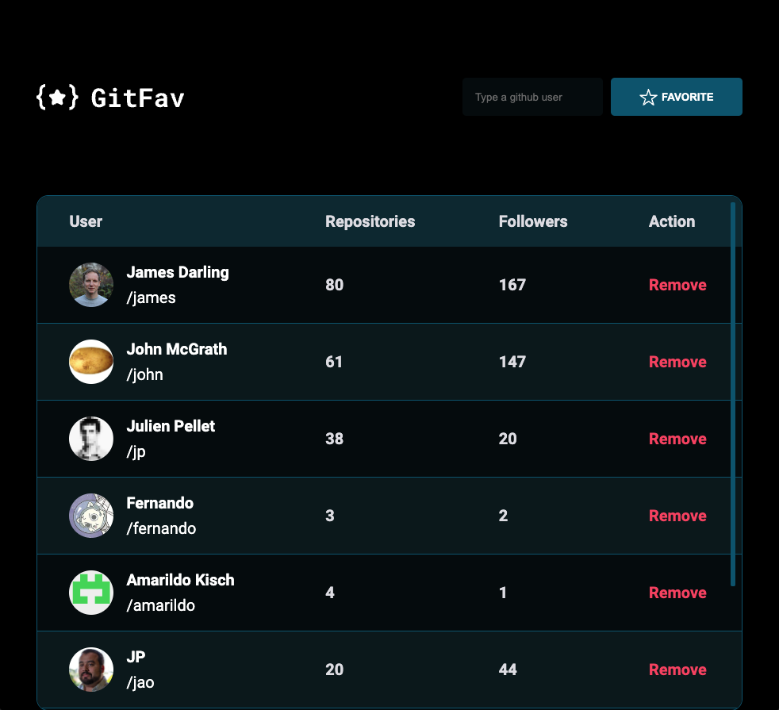
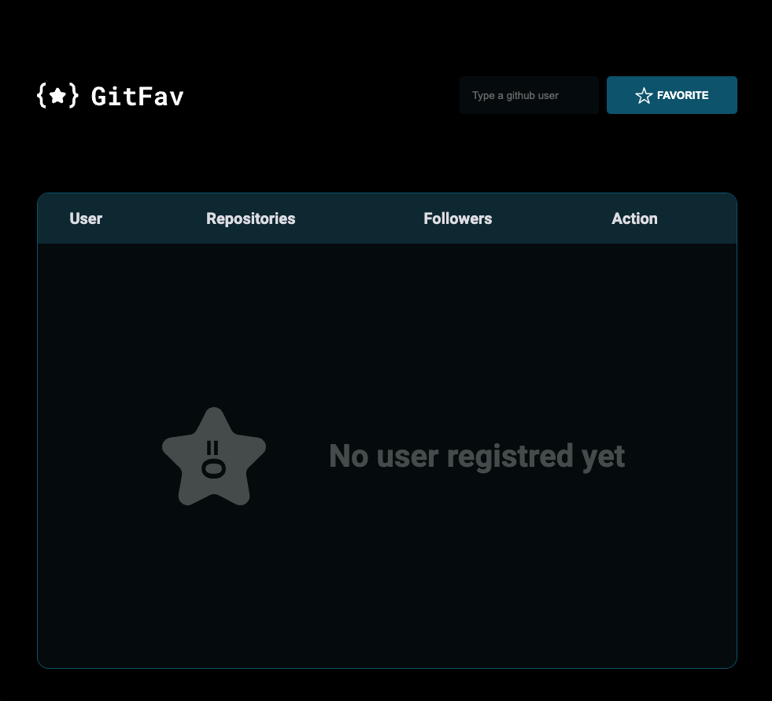

<h1 align="center" style="text-align: center">
  
</h1>

  

GitFav is a project which you can favorite the github users you like. Simply add a new user in the search input and add it, if the user typed does not exist, it returns an error message.

This project was built using HTML, CSS, JavaScritp and it was part of the studies of RocketSeat coding schooll.

> Home

>Home with no users

